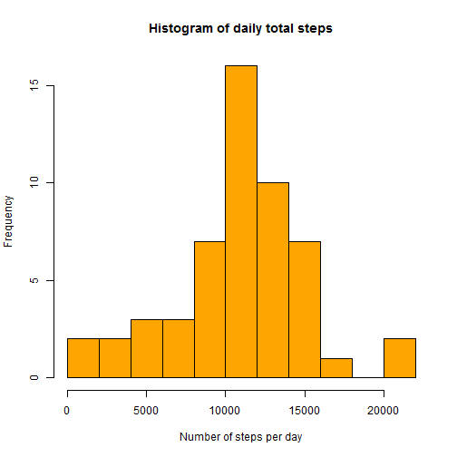
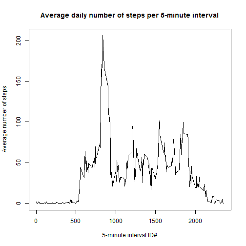
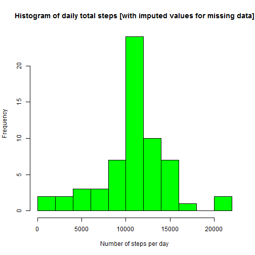
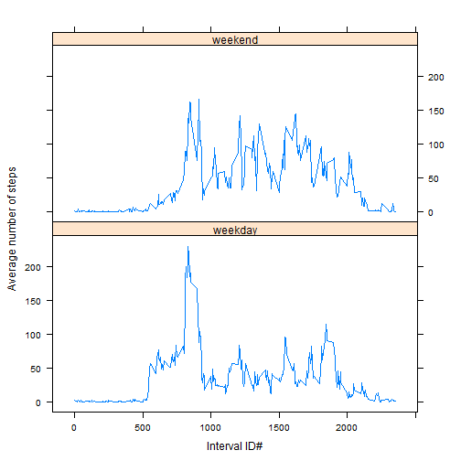

# Reproducible Research: Peer Assessment 1

This assignment looks at data from a personal activity monitoring device, collected every five minutes throughout the day. The data file provided by the Instructor consists of two months of data from one individual collected during the months of October and November, 2012. There is a single activity logged in the data set: the number of steps taken by the anonymous individual during the day, broken up into five minute intervals.


```r
require(knitr)
require(lattice)
```

```
## Loading required package: lattice
```


## Loading and preprocessing the data
We load the Personal Activity data from the CSV file in our working directory and examine its format:


```r
dt <- read.csv("activity.csv")
head(dt)
```

```
##   steps       date interval
## 1    NA 2012-10-01        0
## 2    NA 2012-10-01        5
## 3    NA 2012-10-01       10
## 4    NA 2012-10-01       15
## 5    NA 2012-10-01       20
## 6    NA 2012-10-01       25
```

```r
sapply(dt, class)  # Check the data type of each column
```

```
##     steps      date  interval 
## "integer"  "factor" "integer"
```

## What is mean total number of steps taken per day?
Let us plot the histogram of total steps taken per day, ignoring the NA values for number of steps in the data set. First, we aggregate the data by day, summing up the number of steps in all 288 five minute intervals each day.


```r
dtdaily <- aggregate(steps ~ date, data = dt, FUN = "sum")
head(dtdaily)
```

```
##         date steps
## 1 2012-10-02   126
## 2 2012-10-03 11352
## 3 2012-10-04 12116
## 4 2012-10-05 13294
## 5 2012-10-06 15420
## 6 2012-10-07 11015
```


The aggregated data looks all right. Time for a histogram to look at the distribution of total daily activity over the two month period in October-November, 2012:


```r
hist(dtdaily[, 2], breaks = 10, col = "orange", xlab = "Number of steps per day", 
    main = paste("Histogram of daily total steps"))
```

 

From the aggregated daily data, we can easily calculate the mean and median number of steps per day:

```r
mean(dtdaily[, 2])
```

```
## [1] 10766
```

```r
median(dtdaily[, 2])
```

```
## [1] 10765
```

<font color="#FF0000">
**Mean: 10766 steps per day, Median: 10765 steps** </font>

## What is the average daily activity pattern?

We can plot the activity by 5-minute interval during the day, aggregating the data by interval this time:


```r
dtint <- aggregate(steps ~ interval, data = dt, FUN = "mean")
sapply(dtint, class)
```

```
##  interval     steps 
## "integer" "numeric"
```

```r
plot(dtint$interval, dtint$steps, type = "l", xlab = "5-minute interval ID#", 
    ylab = "Average number of steps", main = "Average daily number of steps per 5-minute interval")
```

 

```r
subset(dtint, dtint$steps == max(dtint$steps))
```

```
##     interval steps
## 104      835 206.2
```


On average across all the days in the dataset, <font color="#FF0000">the peak activity (number of step in a 5-minute interval) occurs around **08:35** in the morning.</font>

## Imputing missing values

Let us find out how many values are missing in the data set provided by the instructor, and replace them with a simple strategy: the average number of steps during the particular interval across the full data set:


```r
naRowNums <- is.na(dt$steps)
sum(naRowNums)  # Gives total number of rows with NA in steps column of dataset
```

```
## [1] 2304
```

```r
dtImputed <- dt  # Create copy of dataset to fill NA's with imputed # of steps
dtImputed$steps[naRowNums] <- as.integer(round(dtint$steps[match(dtImputed$interval[naRowNums], 
    dtint$interval)]))
```

<font color="#FF0000">There are **2304 missing values** in the data set. </font>

We have replaced them with average number of step in the corresponding interval across the entire two-month period, rounded to the nearest integer.

Let us now repeat the mean and median calculations for the modified dataset:


```r
dtIdaily <- aggregate(steps ~ date, data = dtImputed, FUN = "sum")
hist(dtIdaily[, 2], breaks = 10, col = "green", xlab = "Number of steps per day", 
    main = paste("Histogram of daily total steps [with imputed values for missing data]"))
```

 

```r
as.integer(round(mean(dtIdaily[, 2])))
```

```
## [1] 10766
```

```r
median(dtIdaily[, 2])
```

```
## [1] 10762
```

The new values for mean and median for the daily total number of steps are:

<font color="#FF0000">**Mean = 10766, Median=10762**</font>

## Are there differences in activity patterns between weekdays and weekends?

To answer this question, we add a factor variable to the imputed-values data frame. The factor levels for this variable are "weekday" and "weekend". We then aggregate the data by interval, taking the average of the number of steps taken in each interval over the two month period. Plotting the data by the weekend/weekday sepration (factor level) gives us a clean comparison between the level of activity.


```r
dtImputed$day <- weekdays(as.Date(dtImputed$date))
weekendDays <- c("Sunday", "Saturday")
days <- dtImputed$day %in% weekendDays
dtImputed$day[days] <- "weekend"
dtImputed$day[!days] <- "weekday"
dtImputed$day <- as.factor(dtImputed$day)
dtIdaily <- aggregate(steps ~ interval + day, data = dtImputed, FUN = "mean")
xyplot(steps ~ interval | day, data = dtIdaily, type = "l", xlab = "Interval ID#", 
    ylab = "Average number of steps", layout = c(1, 2))
```

 


Looking at the plot of weekday vs. weekend physical activity, <font color="#FF0000">we can draw the following conclusions:</font>

* The subject likely sleeps in on the weekend, waking up around 8 AM, compared with a little after 5:00 AM on weekdays.
* The subject likely has a sedentary job with small amount of walking movement through the work day.
* On weekends, the subject is more active throughout the day than on weekdays.


